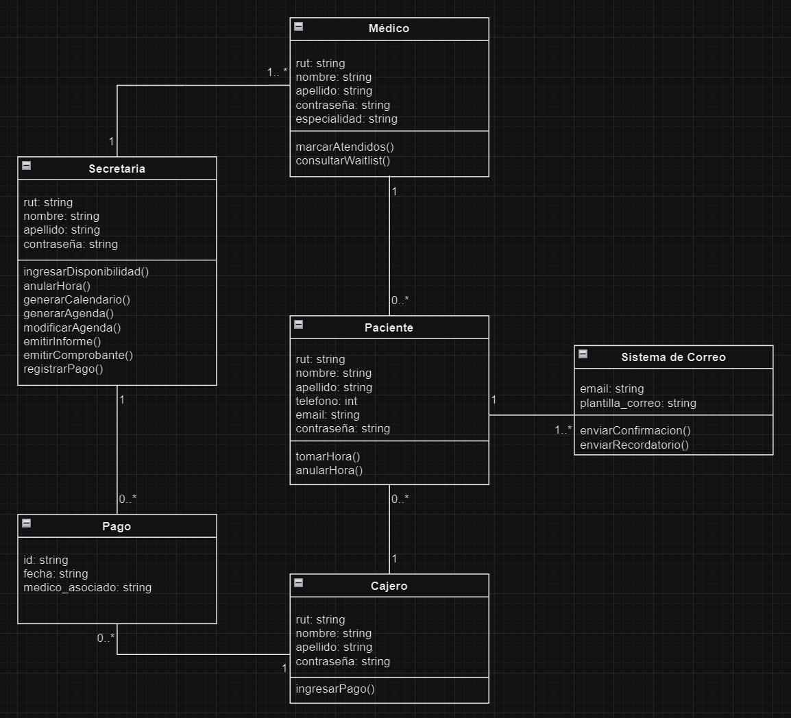

# Sistema de Gestión Médica - Back-End

Este proyecto es un sistema de gestión médica desarrollado en JavaScript y Node.js. El sistema está diseñado para manejar médicos, pacientes, secretarias, pagos y un sistema de correo para enviar notificaciones y recordatorios. A continuación, se proporciona una descripción general del proyecto y su estructura.

---

## **Descripción General**

El objetivo principal de este proyecto es proporcionar un back-end robusto y escalable para la gestión de:
- Registro y manejo de **médicos** y sus agendas.
- Registro de **pacientes** y citas médicas.
- **Pagos** asociados a los servicios médicos.
- **Notificaciones por correo** (confirmaciones y recordatorios).
- Operaciones realizadas por secretarias y cajeros.

El proyecto implementa una API RESTful para interactuar con estas entidades, permitiendo realizar operaciones CRUD de manera eficiente y segura.

---

## **Diagrama de Clases**

El sistema se diseñó basado en el siguiente diagrama de clases:

---
